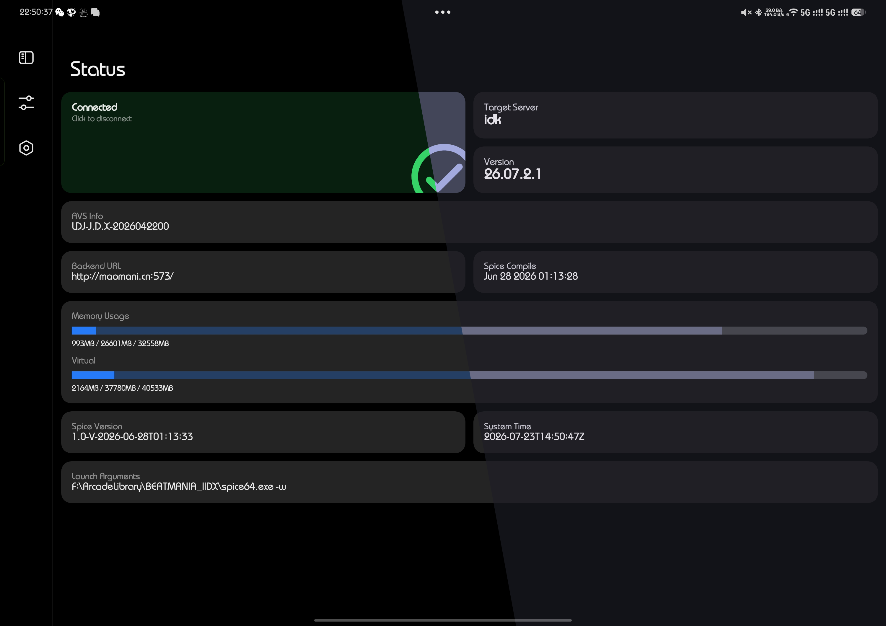
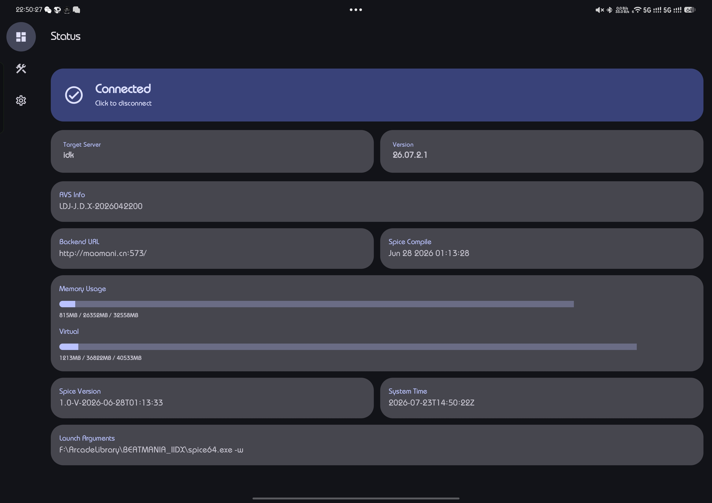
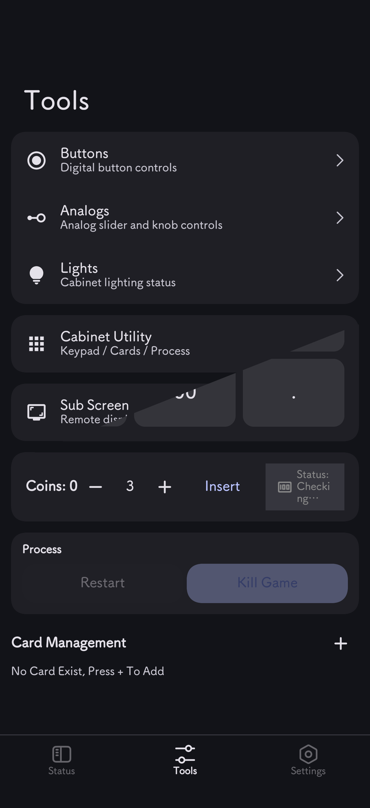
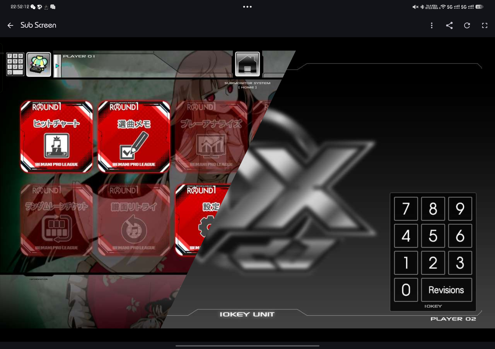
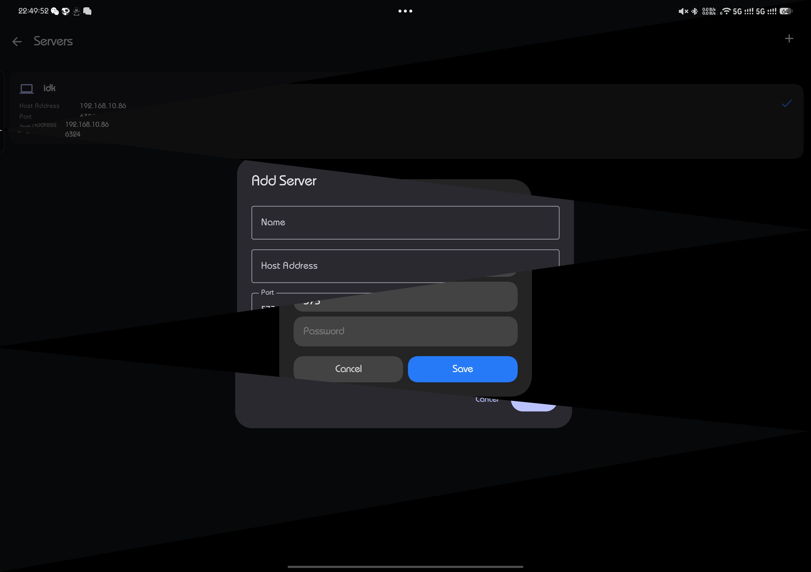

# SpiceCompose

Inspired From [SpiceCompanion](https://github.com/LupinThidr/spicecompanion)

The unofficial companion app to Spice2x. This app allows for remotely
controlling and managing a running instance with the API enabled and
configured.


## Features
sync with [upstream](https://github.com/LupinThidr/spicecompanion/blob/master/README.md?#features)

## Screenshots

<table>
  <tr>
    <td width="33%"></td>
    <td width="33%"></td>
    <td width="34%" rowspan="2"></td>
  </tr>
  <tr>
    <td width="33%"></td>
    <td width="33%"></td>
  </tr>
</table>

## Requirements
- Spice2x
- Android 12+
- NFC (optional)


## FAQ

Q: SpiceCompose doesnt work even connected

A: Shutdown spicecfg.exe


Q: Controller works with err 

A: Still WIP, but [New issue](https://github.com/C-F0x/SpiceCompose/issues/new) welcome


---

## License

```
SpiceCompose — minty kotlin spicecompanion
Copyright (C) 2026  C-F0x

This program is free software: you can redistribute it and/or modify
it under the terms of the GNU General Public License as published by
the Free Software Foundation, either version 3 of the License, or
(at your option) any later version.
```
